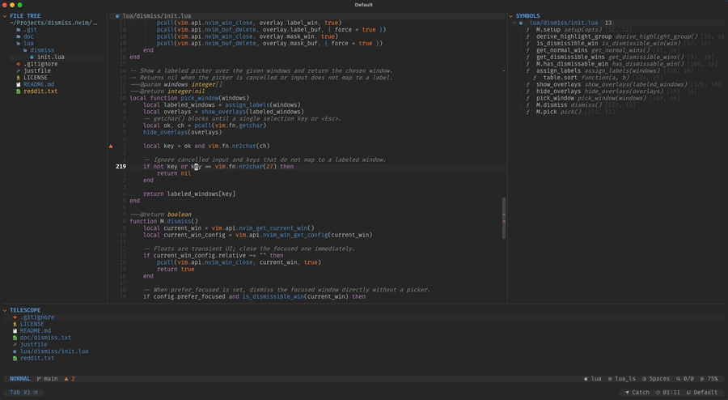

# dismiss.nvim

Next to my main coding window, I usually have a sidebar on the left, a symbol outline on the right, and a quickfix or trouble list on the bottom. I always found it annoying to close one of them, because I had to navigate to that window and press `<c-w>q`. This plugin provides two commands to close windows without breaking your flow.

`dismiss()` is the smart path. You define a set of `dismissible` windows by filetype, buftype, or a custom match condition, and it figures out what to close:

* Current window is a float? Close it.
* Only one `dismissible` window open? Close it.
* Current window is `dismissible`? Close it (configurable).
* More than one `dismissible` window open? Show a labeled picker and let the user decide.

`pick()` skips the rules entirely and opens a labeled picker over all normal windows in the current tabpage — useful when you want to close any window, not just the ones you configured as dismissible.

## 🎬 Demo

[](demo.mp4)

## 🚀 API

```lua
---@param opts? dismiss.ConfigOptions
require("dismiss").setup(opts)
```

Initializes and configures the plugin. See [Configuration](#configuration).

```lua
---@return boolean
require("dismiss").dismiss()
```

Closes a dismissible window according to the rules described above. Returns `true` when a window was closed, `false` when nothing was dismissed (no dismissible windows, or the picker was cancelled).

```lua
---@return boolean
require("dismiss").pick()
```

Opens a labeled picker over all normal windows in the current tabpage, ignoring match rules. If the focused window is a float, it is closed first instead. Returns `true` when a window was closed, `false` when the picker was cancelled.

```lua
---@return boolean
require("dismiss").has_dismissable_win()
```

Returns `true` when the current tabpage contains at least one dismissible window.

## ⚡️ Requirements

Neovim `0.9.0` or newer

## 📦 Installation with `lazy.nvim`

```lua
{
    "tummetott/dismiss.nvim",
    lazy = true,
    ---@type dismiss.ConfigOptions
    opts = {
        -- Optional config overrides
    },
    keys = {
        {
            "<c-q>",
            function()
                require("dismiss").dismiss()
            end,
            mode = { "n", "t" },
            desc = "Dismiss window",
        },
        {
            "g<c-q>",
            function()
                require("dismiss").pick()
            end,
            mode = { "n", "t" },
            desc = "Pick window to close",
        },
    },
}
```

## Configuration

```lua
---@type dismiss.ConfigOptions
{
    -- When true, dismiss() closes the focused window directly if it is
    -- dismissible, without showing the picker.
    prefer_focused = false,
    -- When true, dismiss() closes the current window if no dismissible windows
    -- are found in the tabpage.
    fallback_to_current = false,

    -- Rules for matching dismissible windows.
    match = {
        -- Match normal windows by filetype.
        filetypes = {},
        -- Match normal windows by buftype.
        buftypes = {},
        -- Callback that receives a window id and returns `true` when that
        -- window should be treated as dismissible.
        condition = nil,
    },

    -- Picker appearance.
    picker = {
        -- Characters used as picker labels.
        charset = "jklasdfhguiopqwertnmzxcbv",
        -- Highlight group used for the label overlay.
        hlgroup = "DismissLabel",
    },
}
```

Matching is additive. A window is dismissible when its buffer matches `filetypes`, `buftypes`, or `condition`. At least one matcher must be configured; with all matchers unset, the plugin does nothing.

`match.condition` is useful for windows that cannot be matched by filetype or buftype alone. For example, to make the command-line window (`q:`, `q/`) dismissible:

```lua
condition = function()
    return vim.fn.getcmdwintype() ~= ""
end
```

If `match.condition` throws an error, `dismiss.nvim` ignores it and treats the window as not matched.

If `picker.hlgroup` does not exist, the plugin derives it from `Visual` with `bold = true`.

## 🪟 Picker controls

* Press the displayed label to close the corresponding window.
* `<Esc>` or any unlabeled key cancels the operation.

## 👯 Similar Plugins

* `s1n7ax/nvim-window-picker`
* `radioactivepb/smartclose.nvim`
